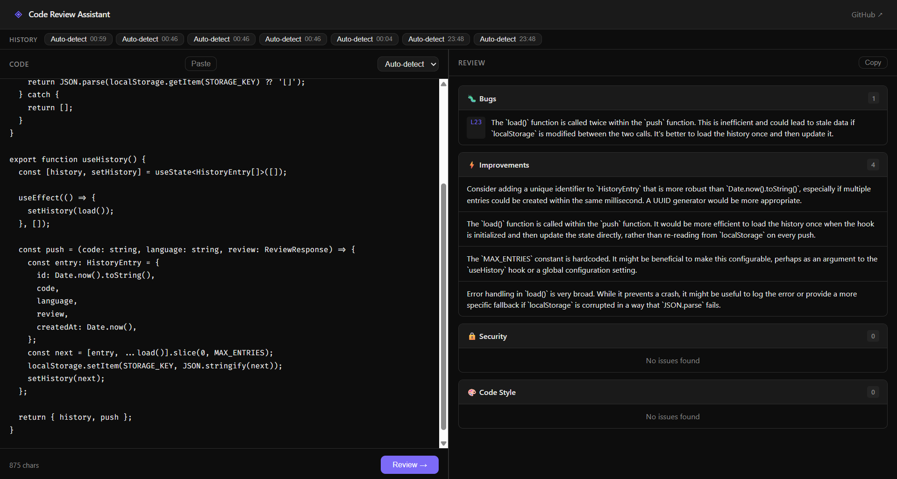

# Code Review Assistant


AI-powered code review in your browser. Paste a snippet, get structured feedback across four categories — streamed in real time.

**[Live →](https://code-review-assistant-vp.vercel.app)**



---

## What it does

- Paste code and select a language
- Review streams back via Gemini 2.5 Flash with animated category status
- Four categories: **Bugs**, **Improvements**, **Security**, **Code Style**
- Copy results, paste from clipboard, browse last 10 reviews from history
- Rate limited at 10 requests/min per IP

## Stack

| Layer | Tech |
|---|---|
| Framework | Next.js 16 (App Router) |
| Language | TypeScript |
| Styles | SCSS (CSS Modules) |
| AI | Gemini 2.5 Flash Lite |
| Rate limiting | Upstash Redis |
| Deploy | Vercel |

## Running locally

```bash
npm install
cp .env.example .env.local
# fill in the env vars
npm run dev
```

Open [http://localhost:3000](http://localhost:3000).

## Environment variables

```env
GEMINI_API_KEY=            # Google AI Studio
NEXT_PUBLIC_APP_URL=       # your deployment URL (used for OG image)
UPSTASH_REDIS_REST_URL=    # Upstash Redis URL
UPSTASH_REDIS_REST_TOKEN=  # Upstash Redis token
```

Get a free Gemini key at [aistudio.google.com](https://aistudio.google.com).  
Get free Upstash Redis at [upstash.com](https://upstash.com).
